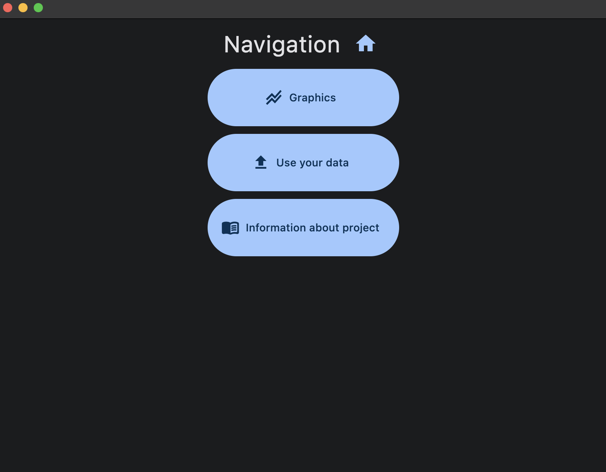
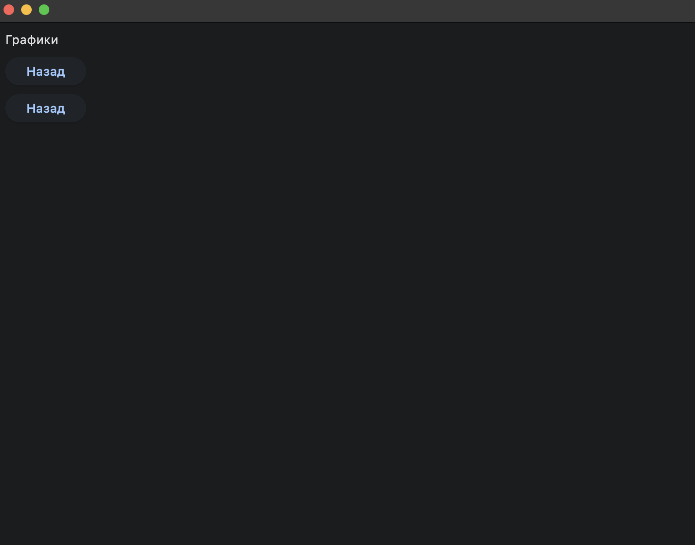
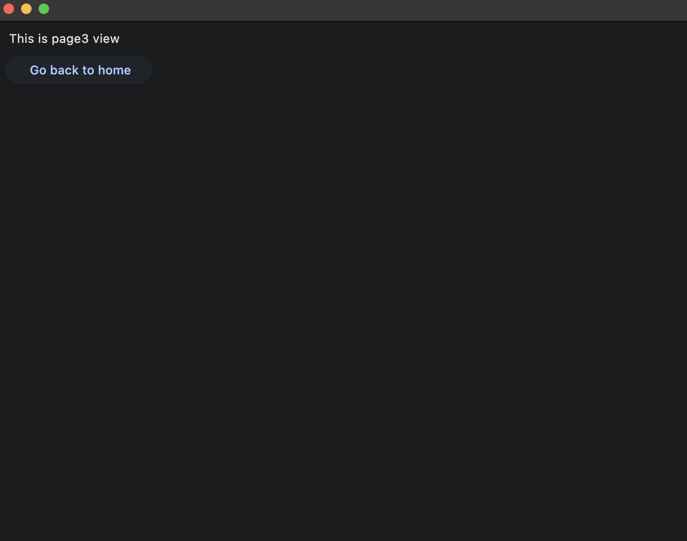
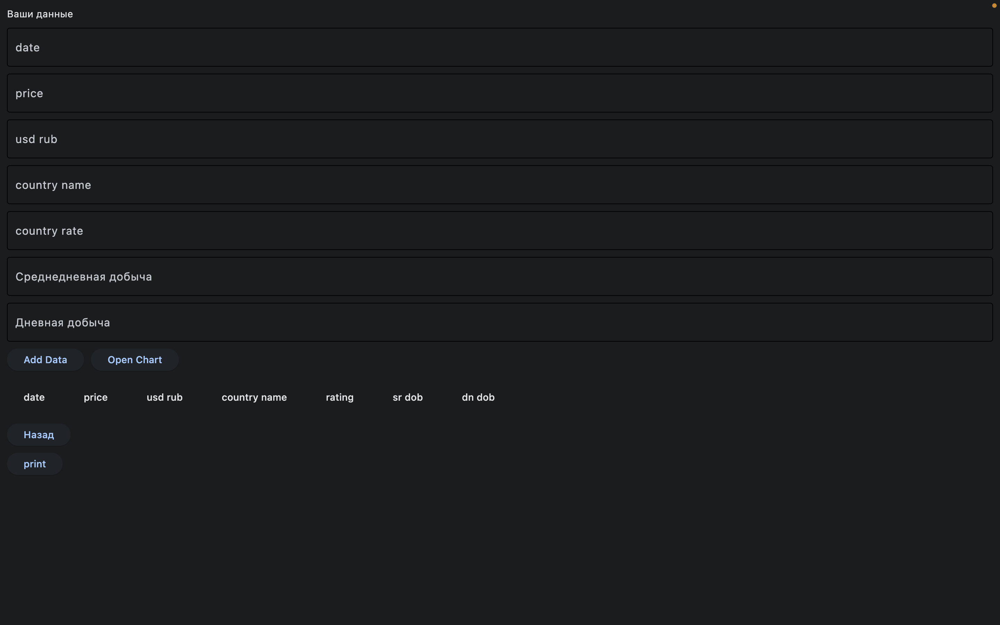

## Как запустить графический интерфейс приложения:
    1. устанавливаете библиотеку flet (pip install flet)
    2. прописываете в консоли flet run main.py

## как работает графический интерфейс:

1. Home page

*home*

2. graphics

*graphics*

3. info

*info*

4. your data page

*urdata*
