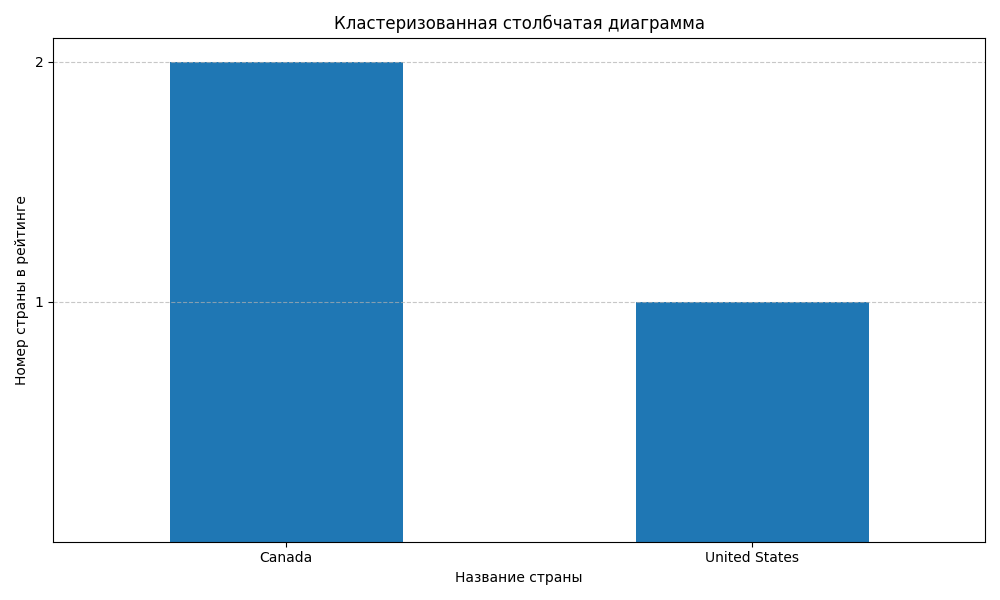
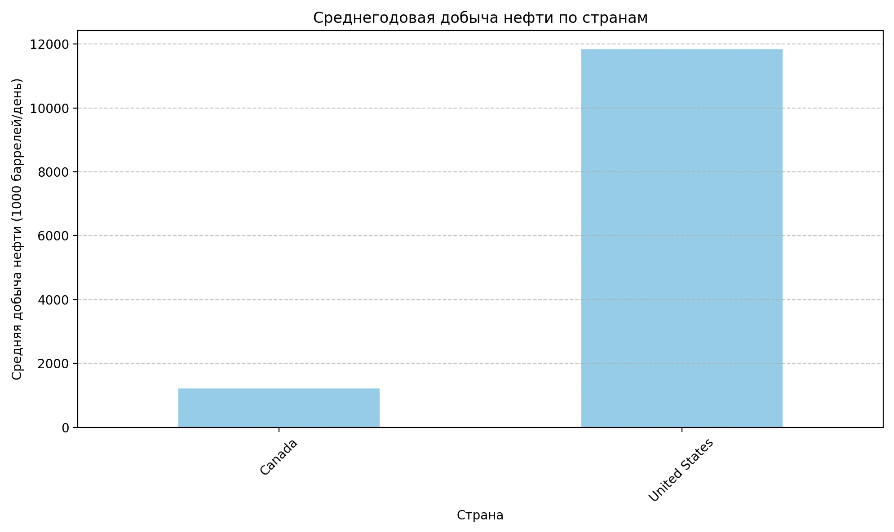
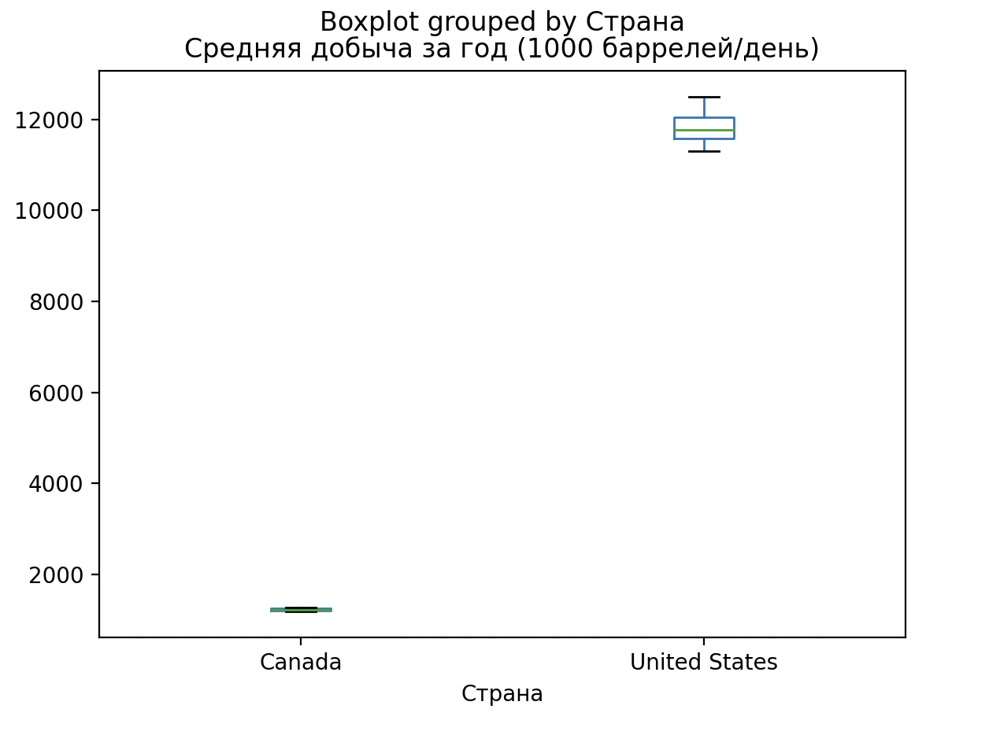
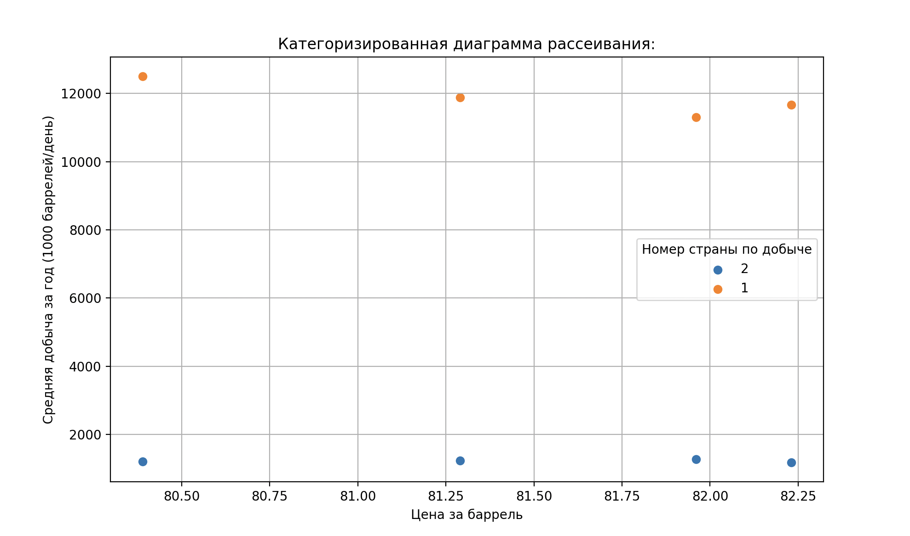

# Проект по анализу данных

Этот проект посвящен анализу данных о добыче нефти. Мы исследуем различные аспекты процесса добычи, включая цены на нефть, объемы добычи, географическое распределение и другие факторы, влияющие на производство нефти. Анализ данных проводится в рамках проекта по дисциплине в ВШЭ
<!-- 
## На данный момент есть рабочие скрипты по выводу графиков и диаграмм с разными атрибутами, а именно:

1. графический отчет «кластеризованная столбчатая диаграмма» для пары «качественный атрибут —качественный атрибут»

*Столбчатая диаграмма для пары "номер страны по добыче" - "название страны"*

2. графический отчет «категоризированная гистограмма» для пары «количественный атрибут—качественный атрибут»

*категоризированная гистограмма для пары "среднегодовая добыча нефти" - "название страны"*

3. графический отчет «категоризированная диаграмма “box-and-whiskers”» для пары «количественный атрибут—качественный атрибут»

*категоризированная диаграмма “box-and-whiskers” для пары "среднегодовая добыча нефти" - "название страны"*

4. графический отчет «категоризированная диаграмма рассеивания» для двух количественных атрибутов и одного качественного атрибута. 

*категоризированная диаграмма рассеивания для "среднегодовая добыча нефти" - "цена за баррель" - "название страны"* -->

## На данный момент имеется:
- [ ] Текстовый отчет
- [ ] Текстовый статистический отчет
- [ ] Текстовый отчет «сводная таблица» для пары качественных атрибутов
- [x] Графический отчет «кластеризованная столбчатая диаграмма» для пары «качественный атрибут—качественный атрибут»
- [x] Графический отчет «категоризированная гистограмма» для пары «количественный атрибут—качественный атрибут»
- [x] Графический отчет «категоризированная диаграмма Бокса-Вискера» для пары «количественный атрибут—качественный атрибут»
- [x] Графический отчет «категоризированная диаграмма рассеивания» для двух количественных атрибутов и одного качественного атрибута
- [ ] Рабочее приложение
- [ ] Рабочая документация

# Запуск приложения
```
pip install -r requirements.txt
python main.py
```