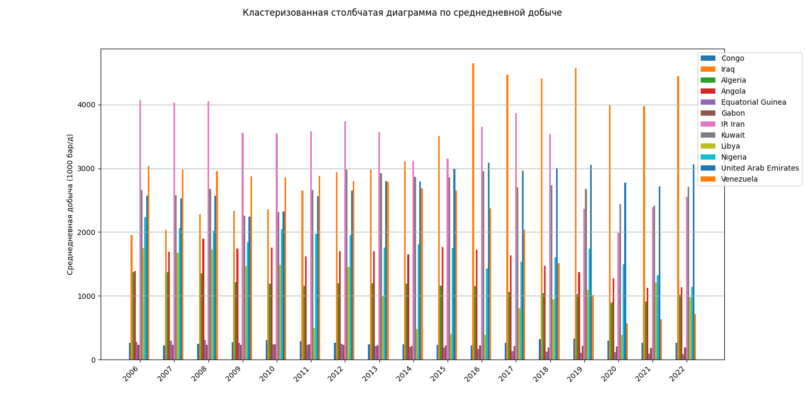
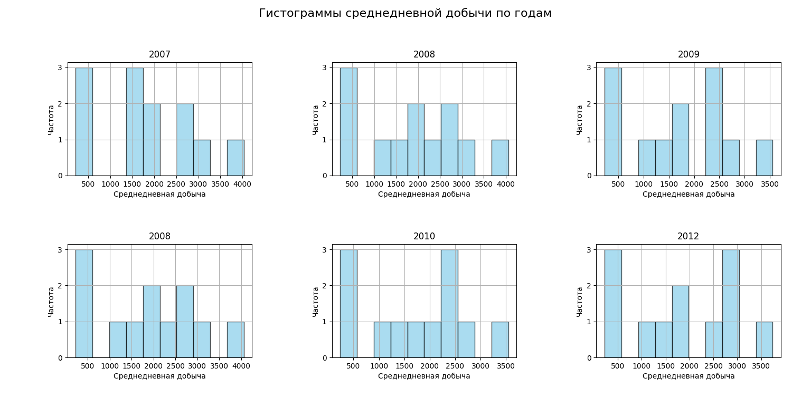
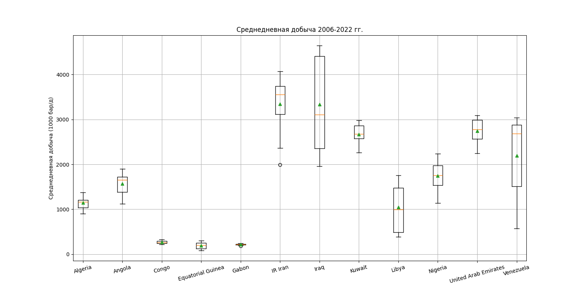
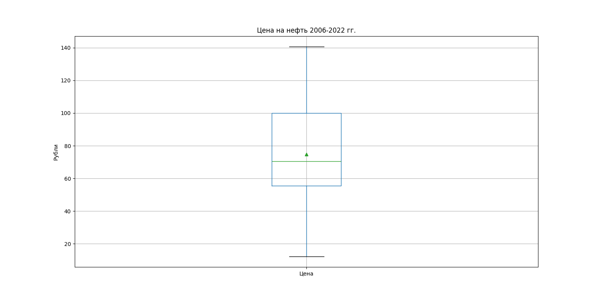
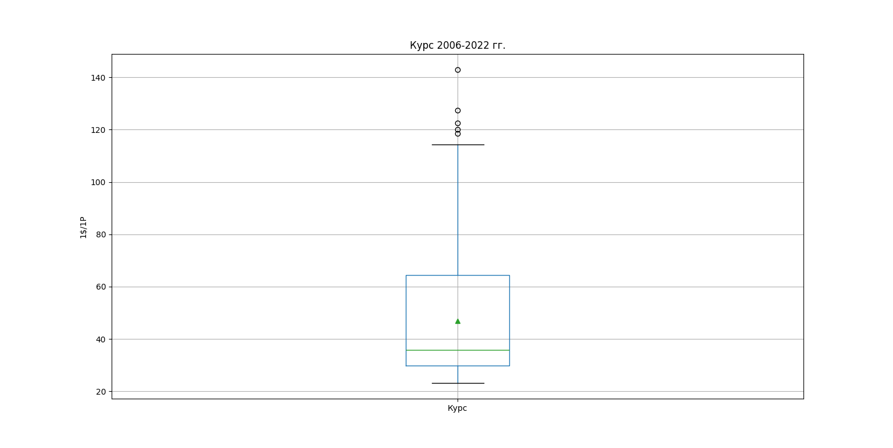
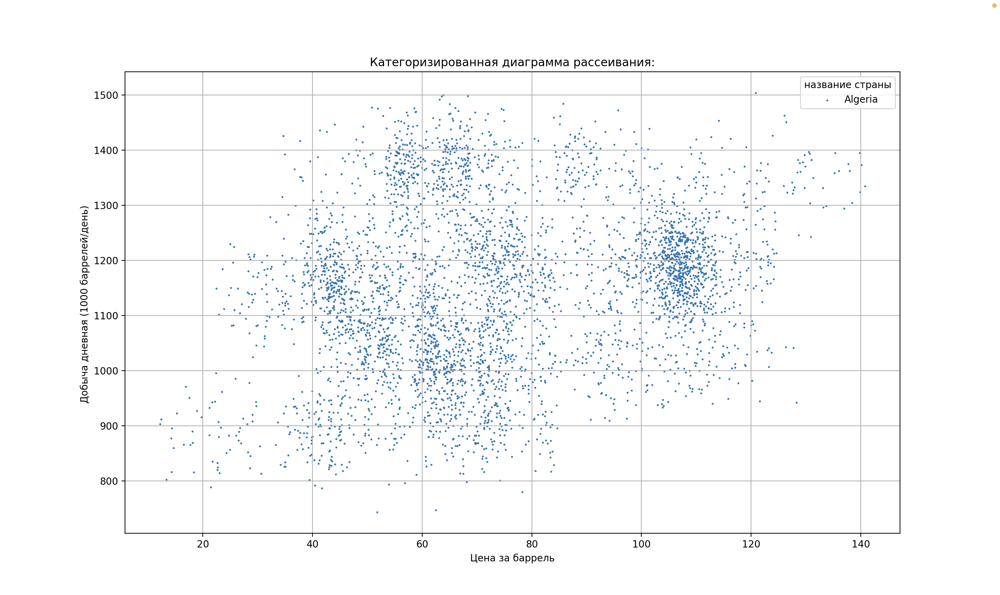
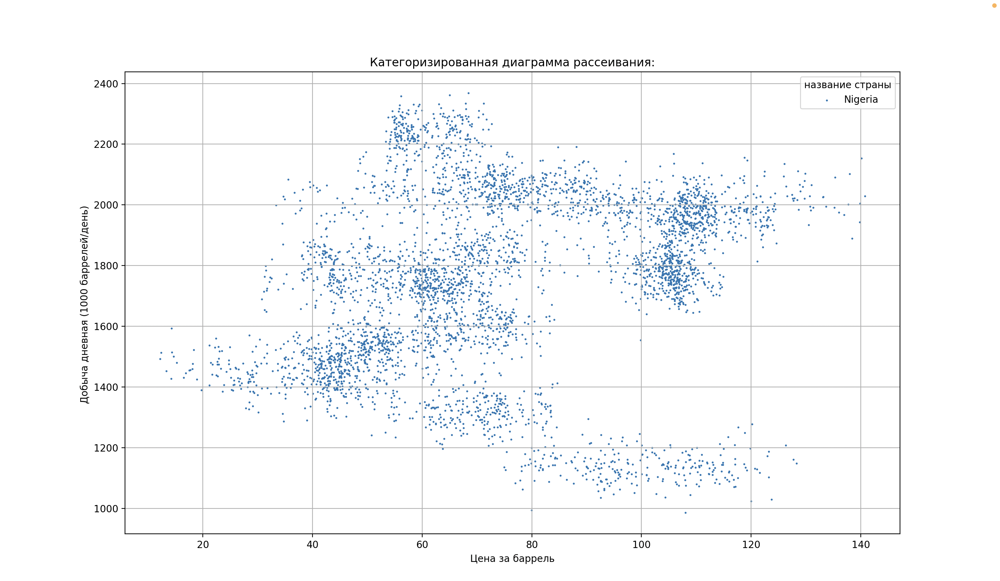

# Проект по анализу данных

Этот проект посвящен анализу данных о добыче нефти. Мы исследуем различные аспекты процесса добычи - цены на нефть, объемы добычи, географическое распределение - влияющие на производство нефти. Анализ данных проводится в рамках проекта по дисциплине ВШЭ МИЭМ ИВТ.

## На данный момент есть рабочие скрипты по выводу графиков и диаграмм с разными атрибутами, а именно:

1. графический отчет «кластеризованная столбчатая диаграмма» для пары «качественный атрибут —качественный атрибут»


2. графический отчет «категоризированная гистограмма» для пары «количественный атрибут—качественный атрибут»


3. графический отчет «категоризированная диаграмма “box-and-whiskers”» для пары «количественный атрибут—качественный атрибут»




4. графический отчет «категоризированная диаграмма рассеивания» для двух количественных атрибутов и одного качественного атрибута. 




## На данный момент имеется:
- [ ] Текстовый отчет
- [ ] Текстовый статистический отчет
- [ ] Текстовый отчет «сводная таблица» для пары качественных атрибутов
- [x] Графический отчет «кластеризованная столбчатая диаграмма» для пары «качественный атрибут—качественный атрибут»
- [x] Графический отчет «категоризированная гистограмма» для пары «количественный атрибут—качественный атрибут»
- [x] Графический отчет «категоризированная диаграмма Бокса-Вискера» для пары «количественный атрибут—качественный атрибут»
- [x] Графический отчет «категоризированная диаграмма рассеивания» для двух количественных атрибутов и одного качественного атрибута
- [ ] Рабочее приложение
- [ ] Рабочая документация

# Запуск приложения
```
pip install -r requirements.txt
python main.py
```